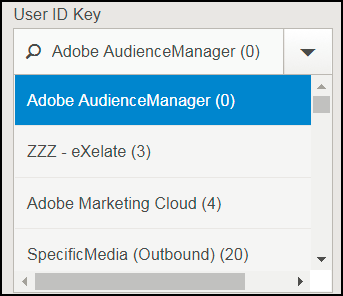
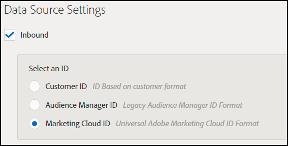

# 目的地設定疑難排解 {#destination-setup-troubleshooting}

可協助您在Audience Manager中設定目的地並避免常見問題的資訊。

## 我已設定目的地，但看不到任何檔案。 它們在哪裡？ {#destination-no-files}

<!-- c_dest_tshooting.xml -->

常見的目的地設定問題包括下列問題：

### 設定錯誤的目的地

* **不正確的[!UICONTROL UserID]索引鍵：** [!UICONTROL UserID]索引鍵是這個目的地的[!UICONTROL MasterDPID]，而且是即將展開之ID值的基礎。 即使可透過下拉式清單選取[!UICONTROL UserID]索引鍵，這並不一定表示有對應至此值的ID/特徵/區段。 如果[!UICONTROL Outbound]程式（會在建立目的地之後執行）找不到對應到此[!UICONTROL UserID]索引鍵的任何使用者，則不會傳回任何資料。
* **選取的檔案資料來源中沒有：**&#x200B;當選擇除了[!UICONTROL S2S]以外的任何目的地型別時，畫面底部會出現一個標示為[!UICONTROL Configure Data Sources]的區段。 第一次出現此區段時，不會選取任何值。 如果您忘記按一下「[!UICONTROL All First Party]」核取方塊，或從「[!UICONTROL Available Data Sources]」視窗中個別選取資料來源，則不會傳回任何資料。

### 格式設定錯誤

為輸出資料選取格式時，如果可能的話，最好重複使用現有格式。 使用已被證明的格式可確保成功產生您的傳出資料。 若要檢視現有格式的確切格式，請按一下功能表列中的[!UICONTROL Formats]選項，然後依名稱或識別碼編號搜尋您的格式。 格式錯誤的格式或格式中使用的巨集將提供格式錯誤的輸出，或會阻止完全輸出資訊。

如需設定格式和使用巨集的詳細資訊，請參閱[檔案格式巨集](formats/file-formats.md#)和[HTTP格式巨集](formats/web-formats.md)。

### 設定錯誤的伺服器

* **[!DNL FTP]**
   * **[!UICONTROL Domain]**
      * 請勿輸入主機名稱的前置詞。 如果您有帳戶[!DNL ftp://hello.com]，只要在此欄位中輸入[!DNL hello.com]即可。
   * **[!UICONTROL Port/Type Combination]**
      * 對於[!DNL FTP]傳輸，偏好的傳輸型別為[!DNL SFTP]。
      * 選取[!DNL SFTP]型別時，連線埠幾乎一律為22。
      * 選取[!DNL FTPs/TLS]型別時，連線埠幾乎一律為21。
      * [!DNL FTPs/TLS]型別與一般[!DNL FTP]傳輸不同。 我們不支援一般（不安全） [!DNL FTP]傳輸。
   * **[!UICONTROL Remote Path]**
      * 選擇遠端子路徑時，輸入時不應使用前置斜線。
      * 如果您要傳送的檔案應該放在[!DNL (root)/inbound]子資料夾中，只要為遠端路徑新增[!DNL inbound]即可，而非[!DNL /inbound]。
      * 如果沿路徑將檔案傳送至多個目錄，請在每個目錄之間輸入斜線。 如果您指定[!DNL /inbound/subdirectory1/subdirectory2]的位置，您應該在此欄位中輸入[!DNL inbound/subdirectory1/subdirectory2]。
      * 如果檔案應放置在外部伺服器自動路由至的目錄中，您可以將此空間留空。 請勿輸入句點( 。 )、斜線( / )或其他任何專案。

* **[!DNL S3]**
   * [!DNL S3]是慣用的傳輸通訊協定（超過[!DNL FTP]或[!DNL HTTP]）。
      * **[!UICONTROL Bucket]**
         * 貯體名稱應該列出時不含斜線、前置詞、尾碼等。 如果您有指定的地址[!DNL s3://your-bucket]，您應該只新增[!DNL your-bucket]到此欄位。
      * **[!UICONTROL Directory]**
         * 除非您特別指定要將資料放置到的子目錄，否則請將此欄位保留空白。 如果您有指定的地址[!DNL s3://your-bucket/your-subdirectory]，請在[!DNL your-bucket]欄位中輸入[!UICONTROL Bucket]，應將[!DNL your-subdirectory]新增至[!UICONTROL Directory]欄位。 請勿新增前面的斜線。
         * 如果您必須沿著路徑瀏覽多個目錄，則只有在您使用斜線作為分隔符號時才會使用。 因此，[!DNL s3://your-bucket/your-subdirectory1/your-subdirectory2]的位置會在[!DNL your-bucket]欄位中輸入[!UICONTROL Bucket]，並在[!DNL your-subdirectory1/your-subdirectory2]欄位中輸入[!UICONTROL Directory]。
      * **[!UICONTROL Access / Secret Keys]**
         * 當[!DNL TechOps]建立儲存貯體並向顧問提供存取/機密金鑰時，這些認證通常是`READ-ONLY`個要傳遞給使用者端的認證。 這些認證不應輸入到[!UICONTROL Access / Secret Key]欄位中，因為這會造成傳輸失敗（因為這些認證是唯讀的，無法寫入）。 在[!DNL TechOps]建立儲存貯體並提供認證的情況下，顧問也應要求Adobe金鑰組 — NOT TO GIVEN THE CLIENT — 允許將檔案寫入此儲存貯體。 應該將該索引鍵新增到這些欄位中。

* **[!DNL HTTP]**
   * **[!UICONTROL Domain]**
      * 請輸入[!DNL HTTP]專案的前置詞資訊。 如果您有帳戶[!DNL https://superduper.com]，請在此欄位中輸入[!DNL https://superduper.com]。
      * **[!UICONTROL URL Prefix]**
         * 新增[!DNL URL]首碼時，請將前斜線保持關閉。 [!DNL https://hello.com/r/x/y/z]的地址應該在[!DNL https://hello.com]欄位中輸入[!UICONTROL Domain]，並在[!DNL r/x/y/z]欄位中在此輸入[!UICONTROL URL Prefix]。
         * 若不需要[!UICONTROL URL Prefix]，請將此值留空。
      * **[!UICONTROL Authentication - SSH Key]**
         * 在此方塊中輸入完整的`SSH PRIVATE`金鑰值，包括頁首、頁尾和分行符號，以確保加密/金鑰儲存準確。

### 沒有足夠的時間產生輸出

外送處理每天執行兩次，而多個處理（外送、發佈、推送至外部位置等）必須在檔案推送至其最終目的地之前執行。 有一個理想的經驗法則是，目的地應於至少24小時完成完整設定，之後才可將資料推送至外部位置。

### 檔案分割大小太大

將檔案外送至目的地時，您可以將較大的外送檔案分割為檔案區塊中。 請確定個別檔案區塊不超過10 GB。 另請參閱[傳出資料檔案名稱：語法和範例](https://experienceleague.adobe.com/docs/audience-manager/user-guide/implementation-integration-guides/receiving-audience-data/batch-outbound-data-transfers/outbound-file-name-contents.html?lang=zh-Hant)。

## 如何設定目的地，以匯出資料檔案中的Experience Cloud ID、客戶ID或Audience Manager ID {#set-up-destinations-export}

此頁面說明如何設定目的地，以匯出您要在[!UICONTROL Outbound Data Files]中輸入ID型別的資料。

<!-- set-up-destinations-mcid-aamid.xml -->

目的地可讓我們的客戶在任意數量的數位頻道上啟用其資料。 例如，他們可以將對象資料匯出至其他[!DNL Adobe Experience Cloud]解決方案（[!DNL Target]、[!DNL Campaign]等）。 或者，他們可以將資料傳送至[!UICONTROL DSP]、[!UICONTROL SSP]或與Audience Manager整合的任何平台。 我們會在[整合Wiki頁面](https://wiki.corp.adobe.com/display/MCPI)上保留與我們合作的合作夥伴清單。

>[!NOTE]
>
>如需在管理員UI中建立目的地的詳細逐步解說，請參閱[建立或編輯公司目的地](companies/admin-manage-company-destinations.md#create-edit-company-destinations)文章。

您的客戶想要根據目的地匯出不同的ID型別。 以下組態圖表顯示您應該選取哪些選項，以匯出與不同ID型別相關的設定檔資訊。 建議您也參考Audience Manager[中的](https://experienceleague.adobe.com/docs/audience-manager/user-guide/reference/ids-in-aam.html?lang=zh-Hant)ID索引。 有三個重要的設定需要考慮： [!UICONTROL User ID Key]、[!UICONTROL Data Source Type]和[!UICONTROL Format]。 我們將在下方詳細介紹所有這些。

* [!UICONTROL User ID Key]。在[!UICONTROL Admin UI]中，移至&#x200B;**[!UICONTROL Companies]**。 搜尋客戶的公司，然後按一下該公司。 尋找&#x200B;**[!UICONTROL Destinations]**&#x200B;索引標籤並按&#x200B;**[!UICONTROL Add Destination]**。 在&#x200B;**[!UICONTROL Add Destination]**&#x200B;工作流程中，選取[!UICONTROL User ID Key]。 [!UICONTROL User ID Key]將篩選來自目標資料來源的傳入ID，並只允許這些ID通過。

  

* [!UICONTROL Data Source Type]。在Audience Manager UI中建立目的地時，請選取此選項。 首先，選取[!UICONTROL Inbound]，然後選取您想要的ID型別。 選項包括：

  

* [!UICONTROL Format]。此選項決定要匯出的檔案格式。 在&#x200B;**[!UICONTROL Add Destination]**&#x200B;工作流程的&#x200B;**[!UICONTROL Batch Data]**&#x200B;下，選取格式。

若要檢查格式，請移至&#x200B;**[!UICONTROL Admin UI > Formats]**&#x200B;並尋找[!UICONTROL Data Row]專案。 此元素包含檔案格式的巨集，在以下範例中為&lt;MCID>。

<table id="table_DAEE5BC75DCB4FC690C4BAE41F627DEC"> 
 <thead> 
  <tr> 
   <th colname="col01" class="entry"> 設定編號 </th> 
   <th colname="col1" class="entry"> 
使用者金鑰 
 </th> 
   <th colname="col2" class="entry"> 
資料Source型別 
 </th> 
   <th colname="col3" class="entry"> 
格式 
 </th> 
   <th colname="col4" class="entry"> 
匯出的ID型別 
 </th> 
  </tr>
 </thead>
 <tbody> 
  <tr> 
   <td colname="col01"> 1 </td> 
   <td colname="col1"> 
Adobe Audience Manager (0) 
 </td> 
   <td colname="col2"> 
Experience Cloud ID 
 </td> 
   <td colname="col3"> 
&lt;DP_UUID&gt; 
 </td> 
   <td colname="col4"> 
Experience Cloud ID 
 </td> 
  </tr> 
  <tr> 
   <td colname="col01"> 2 </td> 
   <td colname="col1"> 
Adobe Audience Manager (0) 
 </td> 
   <td colname="col2"> 
Experience Cloud ID 
 </td> 
   <td colname="col3"> 
MCID 
 </td> 
   <td colname="col4"> 
AUDIENCE MANAGER UUID 
 </td> 
  </tr> 
  <tr> 
   <td colname="col01"> 3 </td> 
   <td colname="col1"> 
Adobe Audience Manager (0) 
 </td> 
   <td colname="col2"> 
Experience Cloud ID 
 </td> 
   <td colname="col3"> 
UUID 
 </td> 
   <td colname="col4"> 
Experience Cloud ID 
 </td> 
  </tr> 
  <tr> 
   <td colname="col01"> 4 </td> 
   <td colname="col1"> 
Adobe Audience Manager (0) 
 </td> 
   <td colname="col2"> 
AUDIENCE MANAGER ID 
 </td> 
   <td colname="col3"> 
&lt;DP_UUID&gt; 
 </td> 
   <td colname="col4"> 
AUDIENCE MANAGER UUID 
 </td> 
  </tr> 
  <tr> 
   <td colname="col01"> 5 </td> 
   <td colname="col1"> 
Adobe Audience Manager (0) 
 </td> 
   <td colname="col2"> 
AUDIENCE MANAGER ID 
 </td> 
   <td colname="col3"> 
MCID 
 </td> 
   <td colname="col4"> 
Experience Cloud ID 
 </td> 
  </tr> 
  <tr> 
   <td colname="col01"> 6 </td> 
   <td colname="col1"> 
Adobe Audience Manager (0) 
 </td> 
   <td colname="col2"> 
AUDIENCE MANAGER ID 
 </td> 
   <td colname="col3"> 
UUID 
 </td> 
   <td colname="col4"> 
AUDIENCE MANAGER UUID 
 </td> 
  </tr> 
  <tr> 
   <td colname="col01"> 7 </td> 
   <td colname="col1"> 
DPID （公司可存取的任何資料來源） 
 </td> 
   <td colname="col2"> 
客戶 ID 
 </td> 
   <td colname="col3"> 
&lt;DP_UUID&gt; 
 </td> 
   <td colname="col4"> 
客戶ID (DPUUID) 
 </td> 
  </tr> 
  <tr> 
   <td colname="col01"> 8 </td> 
   <td colname="col1"> 
DPID （公司可存取的任何資料來源） 
 </td> 
   <td colname="col2"> 
客戶 ID 
 </td> 
   <td colname="col3"> 
MCID 
 </td> 
   <td colname="col4"> 
Experience Cloud ID 
 </td> 
  </tr> 
  <tr> 
   <td colname="col01"> 9 </td> 
   <td colname="col1"> 
DPID （公司可存取的任何資料來源） 
 </td> 
   <td colname="col2"> 
客戶 ID 
 </td> 
   <td colname="col3"> 
UUID 
 </td> 
   <td colname="col4"> 
AUDIENCE MANAGER UUID 
 </td> 
  </tr> 
  <tr> 
   <td colname="col01"> 10 </td> 
   <td colname="col1"> 
DPID （公司可存取的任何資料來源） 
 </td> 
   <td colname="col2"> 
AUDIENCE MANAGER ID 
 </td> 
   <td colname="col3"> 
&lt;DP_UUID&gt; 
 </td> 
   <td colname="col4"> 
AUDIENCE MANAGER UUID 
 </td> 
  </tr> 
  <tr> 
   <td colname="col01"> 11 </td> 
   <td colname="col1"> 
DPID （公司可存取的任何資料來源） 
 </td> 
   <td colname="col2"> 
AUDIENCE MANAGER ID 
 </td> 
   <td colname="col3"> 
MCID 
 </td> 
   <td colname="col4"> 
Experience Cloud ID 
 </td> 
  </tr> 
  <tr> 
   <td colname="col01"> 12 </td> 
   <td colname="col1"> 
DPID （公司可存取的任何資料來源） 
 </td> 
   <td colname="col2"> 
AUDIENCE MANAGER ID 
 </td> 
   <td colname="col3"> 
UUID 
 </td> 
   <td colname="col4"> 
AUDIENCE MANAGER UUID 
 </td> 
  </tr> 
 </tbody> 
</table>

## 使用個案

假設您使用Audience Manager和[!DNL Campaign]。 為了讓客戶資料可在[!DNL Campaign]中操作，您想要匯出[!UICONTROL Experience Cloud IDs]。 在這種情況下，您應該使用設定編號3。
