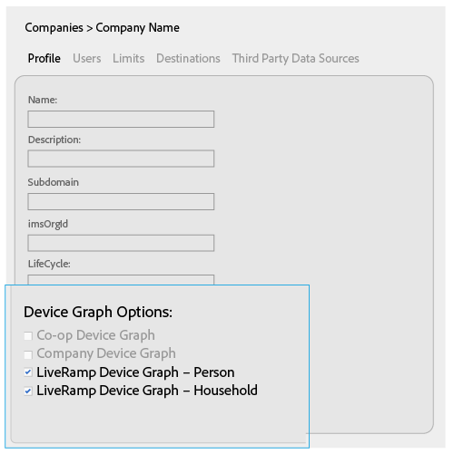

# 適用於公司的裝置圖表選項 {#device-graph-options-for-companies}

[!UICONTROL Device Graph Options]可供參與[!DNL Adobe Experience Cloud Device Co-op]的公司使用。 如果客戶還與整合了Audience Manager的第三方裝置圖表提供者有合約關係，本節將顯示該裝置圖表的選項。 這些選項位於[!UICONTROL Companies] >公司名稱> [!UICONTROL Profile] > [!UICONTROL Device Graph Options]。

此圖例使用第三方裝置圖表選項的通用名稱。 在生產環境中，這些名稱會來自裝置圖表提供者，可能會因此處顯示的名稱而異。 例如，[!DNL LiveRamp]選項通常（但不一定）：

* 開頭為&quot;[!DNL LiveRamp]&quot;
* 包含中間的名稱，名稱會有所不同
* 結尾為&quot;[!UICONTROL - Household]&quot;或&quot;[!UICONTROL -Person]&quot;

## 定義的裝置圖表選項 {#device-graph-options-defined}

您在此選取的裝置圖表選項會在客戶建立[!UICONTROL Profile Merge Rule]時，公開或隱藏[!DNL Audience Manager]客戶可用的[!UICONTROL Device Options]選項。

### Co-op裝置圖表 {#co-op-graph}

參與[Adobe Experience Cloud Device Co-op](https://experienceleague.adobe.com/docs/device-co-op/using/about/overview.html?lang=en)的客戶會使用這些選項，以[決定性和機率資料](https://experienceleague.adobe.com/docs/device-co-op/using/device-graph/links.html?lang=en)來建立[!UICONTROL Profile Merge Rule]。 [!DNL Corporate Provisioning Team]透過後端[!DNL API]呼叫啟用和停用此選項。 您無法在[!DNL Admin UI]中核取或清除這些方塊。 另外，**[!UICONTROL Co-op Device Graph]**&#x200B;與&#x200B;**[!UICONTROL Company Device Graph]**&#x200B;選項互斥。 客戶可以要求我們啟用其中一個，但不能同時啟用兩者。 如果勾選，這會公開[!UICONTROL Profile Merge Rule]之[!UICONTROL Device Options]設定中的&#x200B;**[!UICONTROL Co-op Device Graph]**&#x200B;控制項。

### 公司裝置圖表 {#company-graph}

此選項適用於在其[!DNL Analytics]報表套裝中使用[!UICONTROL People]量度的[!DNL Analytics]客戶。 [!DNL Corporate Provisioning Team]透過後端[!DNL API]呼叫啟用和停用此選項。 您無法在[!DNL Admin UI]中核取或清除這些方塊。 另外，**[!UICONTROL Company Device Graph]**&#x200B;與&#x200B;**[!UICONTROL Co-op Device Graph]**&#x200B;選項互斥。 客戶可以要求我們啟用其中一個，但不能同時啟用兩者。 選取時：

* 此裝置圖表使用屬於您設定之公司的確定性資料（無機率資料）。
* [!DNL Audience Manager]會自動建立名為`*`合作夥伴名稱`*-Company Device Graph-Person`的[!UICONTROL Data Source]。 在[!UICONTROL Data Source]詳細資訊頁面中，[!DNL Audience Manager]客戶可以變更合作夥伴名稱、說明，並將[資料匯出控制項](https://experienceleague.adobe.com/docs/device-co-op/using/device-graph/links.html?lang=en)套用至此資料來源。
* [!DNL Audience Manager]客戶&#x200B;*沒有*&#x200B;在[!UICONTROL Profile Merge Rule]的[!UICONTROL Device Options]區段中看到新設定。

### LiveRamp裝置圖表（個人或家庭） {#liveramp-device-graph}

當合作夥伴建立[!UICONTROL Data Source]並選取&#x200B;**[!UICONTROL Use as an Authenticated Profile]**&#x200B;和/或&#x200B;**[!UICONTROL Use as a Device Graph]**&#x200B;時，[!DNL Admin UI]中會啟用這些核取方塊。 這些設定的名稱是由協力廠商裝置圖表提供者（例如，[!DNL LiveRamp]、[!DNL TapAd]等）所決定。 勾選後，表示您設定的公司將會使用這些裝置圖表提供的資料。

>[!MORELIKETHIS]
>
>* [定義的設定檔合併規則選項](https://experienceleague.adobe.com/docs/audience-manager/user-guide/features/profile-merge-rules/merge-rule-definitions.html?lang=en)
>* [資料Source設定和功能表選項](https://experienceleague.adobe.com/docs/audience-manager/user-guide/features/data-sources/datasources-list-and-settings.html?lang=en)
