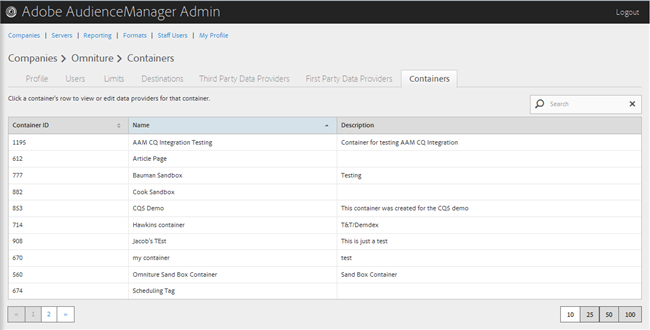

# 管理容器 {#manage-containers}

檢視或編輯容器的資料提供者。

<!-- t_containers.xml -->

>[!NOTE]
>
>依預設，公司是以一個容器建立。 您可以在使用者介面的&#x200B;**[!UICONTROL Tools > Tags]**&#x200B;中為公司建立其他容器。

1. 按一下&#x200B;**[!UICONTROL Companies]**，然後尋找並按一下所需的公司以顯示其[!UICONTROL Profile]頁面。

   使用[!UICONTROL Search]方塊或清單底部的分頁控制項來尋找所需的公司。 您可以按一下所需欄的標頭，以遞增或遞減順序排序每個欄。

1. 按一下「**[!UICONTROL Containers]**」標籤。

   

1. 按一下容器的列，即可檢視或編輯該容器的資料提供者。

   

1. 從&#x200B;**[!UICONTROL Available Data Sources]**&#x200B;和&#x200B;**[!UICONTROL Selected Data Sources for This Container]**&#x200B;清單中行動資料來源，方法是選取所需的資料來源，然後視需要按一下向右或向左的箭頭。

   您也可以從[協力廠商資料提供者](../companies/admin-third-party-providers.md#task_E942DD674D794BA6B8EFD52FD866E689)頁面執行此工作。

1. 若您進行變更，請按一下&#x200B;**[!UICONTROL Save]**。

>[!MORELIKETHIS]
>
>* [與 Media Optimizer 同步的 ID](../companies/admin-amo-sync.md#concept_2B5537233DAA4860B3503B344F937D83)
