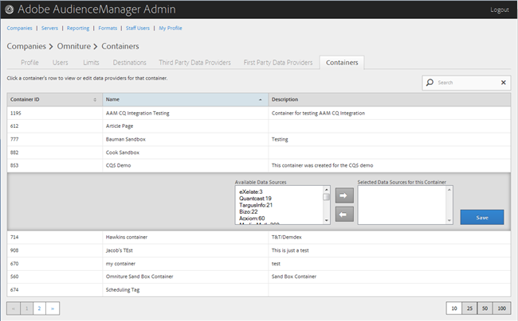

# 管理容器 {#manage-containers}

查看或編輯容器的資料提供程式。

<!-- t_containers.xml -->

>[!NOTE]
>
>預設情況下，公司使用一個容器建立。 您可以在用戶介面中為公司建立更多容器， **[!UICONTROL Tools > Tags]**。

1. 按一下 **[!UICONTROL Companies]**，然後找到並按一下所需的公司以顯示其 [!UICONTROL Profile] 的子菜單。

   使用 [!UICONTROL Search] 或清單底部的分頁控制項，以查找所需的公司。 通過按一下所需列的標題，可以按升序或降序對每列進行排序。

1. 按一下 **[!UICONTROL Containers]** 頁籤。

   

1. 按一下容器的行可查看或編輯該容器的資料提供程式。

   

1. 從 **[!UICONTROL Available Data Sources]** 和 **[!UICONTROL Selected Data Sources for This Container]** 列出，方法是選擇所需的資料源，然後根據需要按一下右箭頭或左箭頭。

   您也可以從 [第三方資料提供程式](../companies/admin-third-party-providers.md#task_E942DD674D794BA6B8EFD52FD866E689)的子菜單。

1. 按一下 **[!UICONTROL Save]** 的雙曲餘切值。

>[!MORELIKETHIS]
>
>* [與 Media Optimizer 同步的 ID](../companies/admin-amo-sync.md#concept_2B5537233DAA4860B3503B344F937D83)

