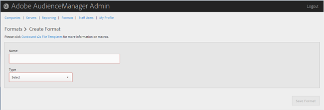

# 建立或編輯格式 {#create-or-edit-a-format}

使用Audience Manager管理工具中的[!UICONTROL Formats]頁面來建立新格式或編輯現有格式。

<!-- t_create_format.xml -->

>[!TIP]
>
>為輸出資料選取格式時，如果可能的話，最好重複使用現有格式。 使用已被證明的格式可確保成功產生您的傳出資料。 若要檢視現有格式的確切格式，請按一下功能表列中的[!UICONTROL Formats]選項，然後依名稱或識別碼編號搜尋您的格式。 格式錯誤的格式或格式中使用的巨集將提供格式錯誤的輸出，或會阻止完全輸出資訊。

1. 若要建立新格式，請按一下&#x200B;**[!UICONTROL Formats]** > **[!UICONTROL Add Format]**。 若要編輯現有格式，請在&#x200B;**[!UICONTROL Name]**&#x200B;欄中按一下所需的格式。

   

1. 填寫欄位: 
   * **名稱：** （必要）提供格式的描述性名稱。
   * **型別：** （必要）選取所要的格式：
      * **[!UICONTROL File]**：透過[!DNL FTP]個檔案傳送資料。
      * **[!UICONTROL HTTP]**：將資料封裝在[!DNL JSON]包裝函式中。

1. （視條件而定）如果您選擇&#x200B;**[!UICONTROL File]**，請填入欄位：

   >[!NOTE]
   >
   >如需可用的巨集清單，請參閱[檔案格式巨集](../formats/file-formats.md#concept_A867101505074418A58DE325949E5089)和[HTTP格式巨集](../formats/web-formats.md#reference_C392124A5F3F42E49F8AADDBA601ADFE)。

   * **[!UICONTROL File Name]：**&#x200B;指定資料傳輸檔案的檔案名稱。
   * **標頭：**&#x200B;指定資料傳輸檔案第一列中顯示的文字。
   * **[!UICONTROL Data Row]：**&#x200B;指定出現在檔案每個外出資料列中的文字。
   * **[!UICONTROL Maximum File Size (In MB)]：**&#x200B;指定資料傳輸檔案的大小上限。 壓縮檔案必須小於100 MB。 未壓縮檔案大小沒有限制。
   * **[!UICONTROL Compression]：**&#x200B;為您的資料檔案選取所需的壓縮型別： gz或zip。 若要傳送至[!UICONTROL AWS S3]，您必須使用.gz或未壓縮的檔案。
   * **[!UICONTROL .info Receipt]：**&#x200B;指定產生傳輸控制([!DNL .info])檔案。 [!DNL .info]檔案提供有關檔案傳輸的中繼資料資訊，讓合作夥伴可以驗證Audience Manager是否正確處理檔案傳輸。 如需詳細資訊，請參閱記錄檔傳輸的[傳輸控制檔](https://experienceleague.adobe.com/docs/audience-manager/user-guide/implementation-integration-guides/receiving-audience-data/batch-outbound-data-transfers/transfer-control-files.html?lang=zh-Hant)。
   * **[!UICONTROL MD5 Checksum Receipt]：**&#x200B;指定產生[!DNL MD5]總和檢查碼回條。 [!DNL MD5]總和檢查碼回條，讓合作夥伴可以驗證Audience Manager是否正確處理完整傳輸。

1. （視條件而定）如果您選擇&#x200B;**[!UICONTROL HTTP]**，請填入欄位：

   * **[!UICONTROL Method]：**&#x200B;選擇您要用於傳輸程式的[!DNL API]方法：
      * **[!UICONTROL POST]：**&#x200B;如果您選取[!DNL POST]，請選取內容型別（[!DNL XML]或[!DNL JSON]），然後指定要求內文。
      * **[!UICONTROL GET]：**&#x200B;如果您選取[!DNL GET]，請指定查詢引數。

1. 如果您正在建立新格式，請按一下&#x200B;**[!UICONTROL Create]**，如果您正在編輯現有格式，請按一下&#x200B;**[!UICONTROL Save Updates]**。

## 刪除格式 {#delete-format}

1. 按一下 **[!UICONTROL Formats]**。
2. 按一下所需格式之欄中的&#x200B;**[!UICONTROL Actions]**。
3. 按一下&#x200B;**[!UICONTROL OK]**&#x200B;以確認刪除。
