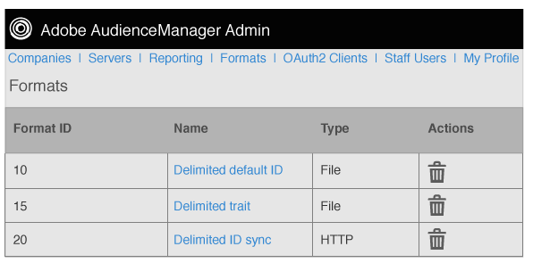

# 格式概述 {#formats-overview}

格式是一種儲存的範本（或檔案），它使用巨集來組織傳送到目的地的資料內容。 格式型別包括[!DNL HTTP]格式和檔案格式。 [!DNL HTTP]格式使用[!DNL JSON]或[!DNL POST]方法在[!DNL GET]物件中傳送資料。 檔案格式會由[!DNL FTP]以檔案傳送資料。 每種格式使用的巨集可讓您設定檔案名稱、定義檔案標題，以及組織資料檔案的內容。 在Admin [!DNL UI]中，您可以在設定客戶的目的地時建立、儲存及重複使用格式。

